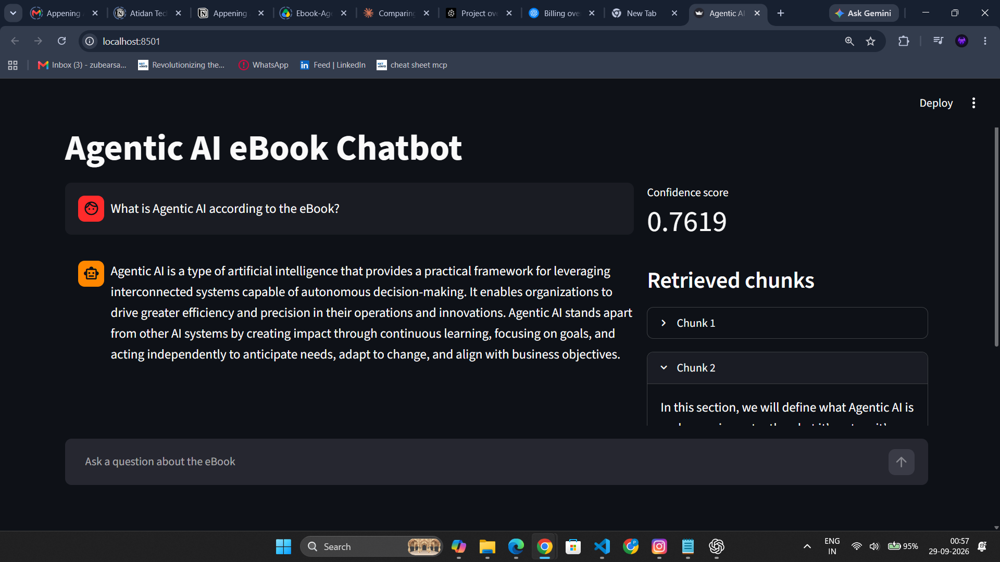
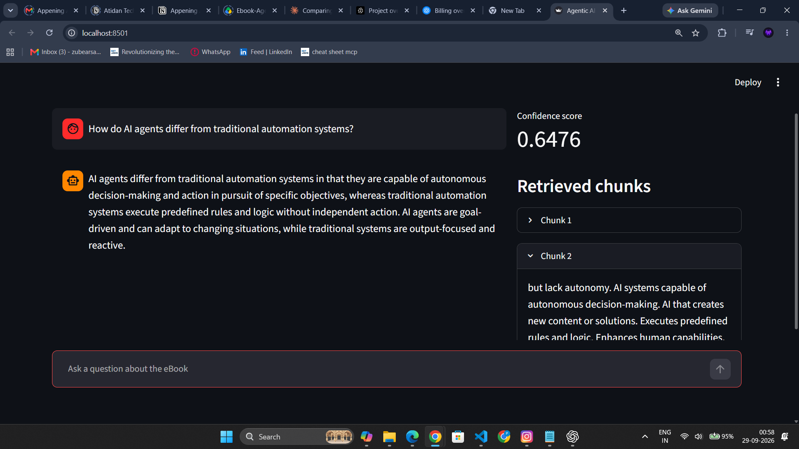
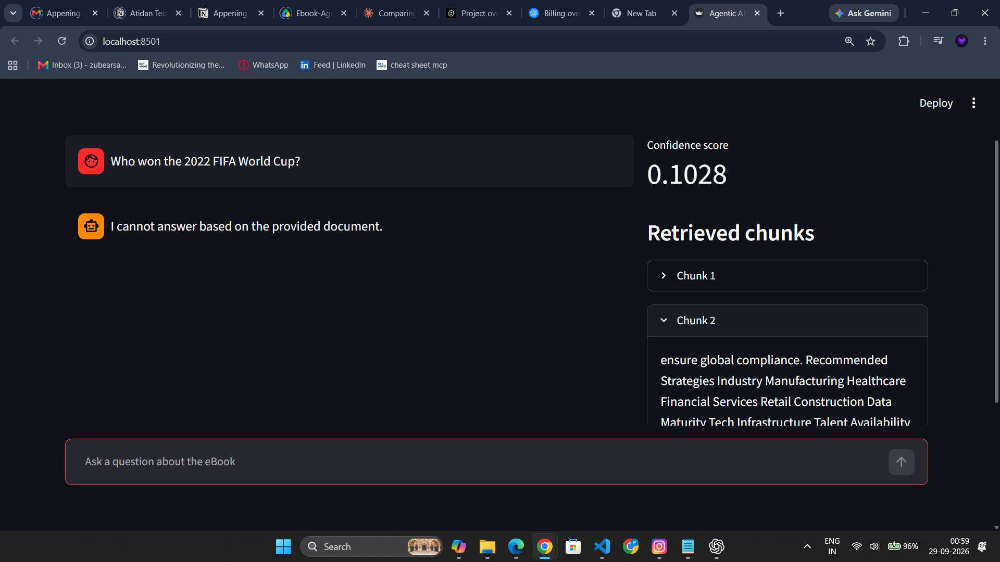

# Agentic AI eBook RAG Chatbot

A Retrieval-Augmented Generation chatbot that answers **only** from the Agentic AI eBook.
Stack: Python, LangChain, LangGraph, Pinecone, OpenAI, FastAPI (Streamlit optional).

## Architecture

```
PDF -> PyPDFLoader -> RecursiveCharacterTextSplitter (1000/200)
    -> OpenAI text-embedding-3-small (1536-d) -> Pinecone (cosine)

Question -> [retrieve node] top-k chunks + cosine scores
         -> [generate node] guard on score -> strict-context prompt -> gpt-4o-mini
         -> { answer, retrieved_chunks, confidence_score }
```

LangGraph state: `question`, `context`, `answer`, `score`. Graph: `START -> retrieve -> generate -> END`.

### Grounding and confidence
- The prompt forbids outside knowledge and requires a fixed refusal sentence when context is insufficient.
- `confidence_score` is the top retrieved chunk's cosine similarity (not a hard-coded value).
- If the best similarity is below `RELEVANCE_THRESHOLD` (config.py), the LLM is not called and the refusal is returned.
- If the LLM itself refuses, the score is set to 0.0.

## Project structure

```
data/Ebook-Agentic-AI.pdf   source document
src/config.py               env + constants
src/ingestion.py            load, chunk, embed, upsert
src/graph.py                LangGraph workflow
app.py                      FastAPI  (POST /chat)
streamlit_app.py            optional UI
tests_sample_queries.py     5 benchmark queries
```

## Setup

```bash
python -m venv venv
source venv/bin/activate        # Windows: venv\Scripts\activate
pip install -r requirements.txt
cp .env.example .env            # add OPENAI_API_KEY and PINECONE_API_KEY
```

## Ingest (once)

```bash
python -m src.ingestion
```
If the Drive download fails, save the PDF manually to `data/Ebook-Agentic-AI.pdf` and re-run.

## Run

```bash
uvicorn app:app --reload                 # API at http://127.0.0.1:8000/docs
streamlit run streamlit_app.py           # optional UI
```

Example:
```bash
curl -X POST http://127.0.0.1:8000/chat -H "Content-Type: application/json" \
  -d '{"query": "What is Agentic AI according to the eBook?"}'
```

Response: `{ "answer": "...", "retrieved_chunks": ["..."], "confidence_score": 0.0 }`

## Tests

With the server running:
```bash
python tests_sample_queries.py
```
Covers 4 in-document questions plus 1 out-of-scope question (2022 FIFA World Cup) that must be refused.

## Test results




